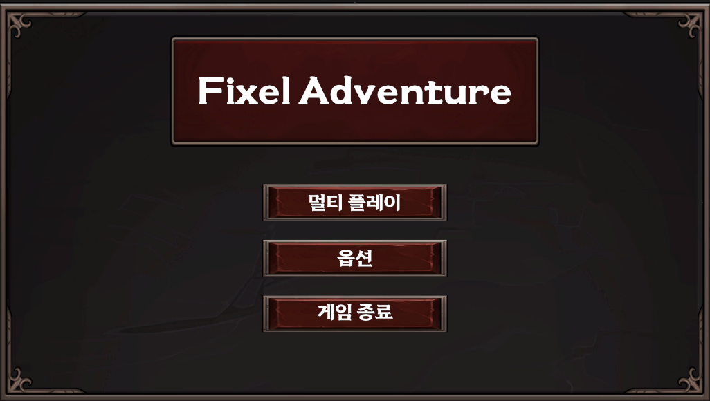
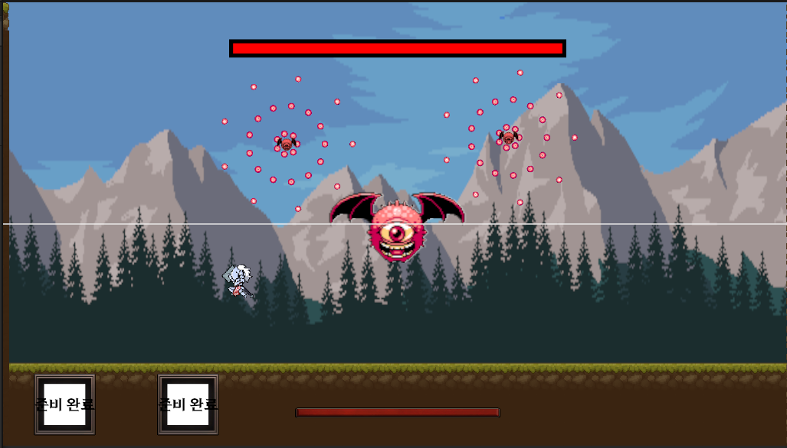

# Pixel Adventure 

Pixel Adventure는 다른 플레이어들과 협동하는 멀티 2D 플랫포머RPG입니다.
8명 특수한 스킬을 가진 플레이들 중에서 골라 

## ❓ 목표

직업을 선택 하고 앞으로 가면서 주위의 잡몹들을 해치우고 보스를 격파하는 것입니다.

## 🕒 개발기간
2024.06.27 ~ 2024.08.22

## 🤝 팀원  
- 손효재
- 최도규
- 김성훈
- 함지운
  
## 🎮 조작
- 이동 : 방향키
- 점프 : SpaceBar
- 달리기 : Shift + 방향키
- 공격 : MouseLeft
- Q스킬버튼 : Q
- E스킬버튼 : E

## 플레이어 직업
|직업|특징|Q스킬|E스킬|
|---|---|---|---|
|검사|검으로 싸우는 직업입니다.|적의 공격을 일시적으로 막습니다.|검에서 투사체를 날려 적을 공격합니다.|
|궁수|원거리에서 활로 싸우는 직업입니다.|와이어화살을 날려 맞춘 위치까지 날아갑니다.|동시에 3발의 폭발화살을 날려 범위데미지를 적에게 입힘니다.|
|거너|6발을 쏘고 장전을 하는 리볼버로 싸우는 직업입니다.|빠르게 6발을 순간적으로 쏩니다.|굴러서 적의 공격을 피합니다.|
|워리어|강력한 망치로 적을 공격하는 직업입니다.|적의 투사체를 막는 방어막을 생성합니다.|강력하게 내려쳐 적에게 큰 데미지를 입힙니다.|
|마법사|적에게 자동으로 날아가는 마법탄을 날리는 직업입니다.|아군에게 혹은 아군이 없을시 방어막을 씌워 적의 투사체와 공격을 막습니다.|적을 투과하는 레이저를 발사해 데미지를 입힘니다.|
|도적|빠르게 근거리에서 적을 공격하는 직업입니다.|빠르게 대시를 해 지나가는 적들에게 데미지를 입힘니다.|플레이어가 적을 맞춘 만큼 스텍이 쌓이고 그 만큼 적에게 데미지를 넣는 공격을 합니다.|
|스나이퍼|적에게 멀리서 강력한 한발한발 날리는 직업입니다.|타겟을 지정해 적에게 생성된 타겟마크를 맞추면 강력한 데미지를 입힙니다.|수류탄을 발사해 부딪친 범위에 강력한 도트데미지가 들어가게 합니다.|
|팔리단|아군을 보조하고 근거리에서 싸우는 직업입니다.|자신을 포함해 주위의 아군을 회복시킵니다.|적에게 돌진해 데미지를 입힙니다.

